# Creating WebThings with JavaScript on Microcontrollers

This document explains how to run WebThings examples on the oddWires IoT-Bus development board from a browser-based interface. The document assumes WebThings Workshop host application is already installed on the oddWires board.

## Table of Contents

* [Configuring your Device](#config)
* [About the WebIDE](#webide)
* [WebThings Examples](#examples)
* [Running Examples](#running-examples)
* [Connecting to the WebThings Gateway](#gateway)
* [Resources](#resources)
* [Troubleshooting](#troubleshooting)

<a id="config"></a>
## Configuring the Device

When you power on the oddWires board, you'll see the following screen.


### Connecting to Wi-Fi

Before you can run examples that turn the device into a WebThing, you first need to connect the device to Wi-Fi. Your laptop, oddWires development board, and WebThings Gateway must all be connected to the same network.

When you tap the Wi-Fi button at the top of the screen, the device begins scanning for available networks. If you tap the name of an open network, the device will connect to that network. If you tap the name of a password-protected network, you will see an on-screen keyboard to enter the password.

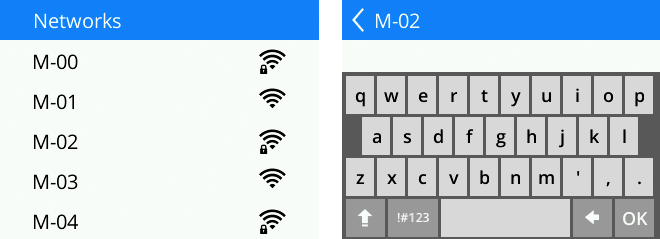

Once you successfully connect to a Wi-Fi network, the application saves the Wi-Fi credentials and returns to the main screen. On subsequent boots, it attempts to connect to the same network so you don't have to enter the password again.

### Naming your Device

By default, each device has a unique name. This name is used as the hostname of your device so you can easily determine which device is yours from the gateway. You can change the name by tapping the Name button in the middle of the screen. 

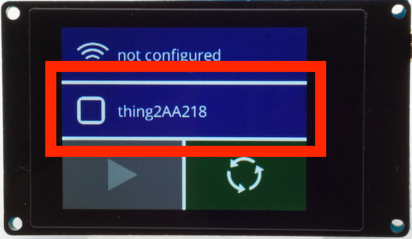

<a id="webide"></a>
## About the WebIDE

The WebIDE is a development tool to edit, build, install, run, and debug JavaScript code for microcontrollers using the Moddable SDK.  It allows you to install JavaScript applications built with the Moddable SDK on your device from the browser without having to install any additional software or drivers. It is an alternative to some of the command line build tools in the Moddable SDK.

The WebIDE is available at [ide.moddable.com](https://ide.moddable.com).

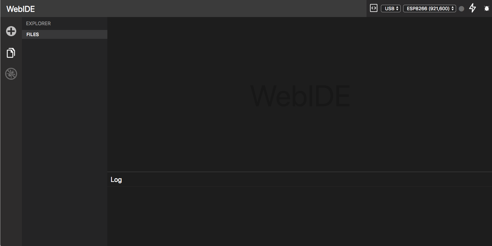

The WebIDE connects can connect to devices using both USB and WebSockets. To connect over USB, it uses [WebUSB](https://developers.google.com/web/updates/2016/03/access-usb-devices-on-the-web). At this time, WebUSB is only implemented in Chrome. If you don't have Chrome already, you can download it [here](https://www.google.com/chrome/).

> The repository for the main project is [on GitHub](https://github.com/FWeinb/moddable-webide). Special thanks to [FWeinb](https://github.com/FWeinb) for developing it. The version used for this workshop is also [on GitHub](https://github.com/lprader/moddable-webide).

<a id="examples"></a>
## WebThings Examples

Several example WebThings are provided to get you started. Each example simulates a different type of device using the oddWires board and Moddable SDK. The following examples are provided:

- On/Off light
- Digital sign
- Thermometer (using an external temperature sensor)


The Light and Sign run using only the oddWire development board and do not require any additional setup. The thermometer example requires a TMP102 temperature sensor to be plugged into the board in the following configuration:

| TMP102 | oddWires board|
| :---: | :---: |
|VCC | 3V3
|GND | GND
|SDA | IO21
|SCL | IO22

### Viewing and editing the source code

The source code for the examples is included in the WebIDE. To open an example, simply click on the name of the example in the Projects tab.

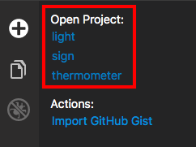

To view different files, go to the File explorer. 

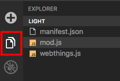

Each example includes three files:

1. `mod.js` - The entry point of the application
2. `webthings.js` - The Moddable WebThings module
3. `manifest.json` - The application's [manifest](https://github.com/Moddable-OpenSource/moddable/blob/public/documentation/tools/manifest.md), a file that describes which modules and resources are necessary to build the application
 
### Duplicating examples

The examples are provided as a starting point. You are free to modify them as you see fit. If you want to start a new project using the original source code from an example, you can install additional copies by following these steps:

1. Go to the Projects view in the WebIDE and click **Import GitHub Gist**.

	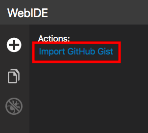

3. Enter a name for the project.

	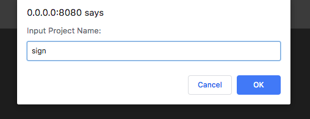
	
4. Enter the gist ID for the example you want to run.

	- On/Off light: `c2e638a2e8ebaff796d67f2d2dd0783d`
	- Digital sign: `9f526d43030bd3c96fead27eebaf5303`
	- Thermometer: `514a010e7acff8520f60839ecc749da5`

	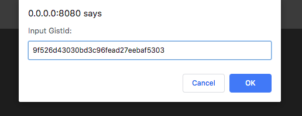

You may also download the examples from [here](https://www.moddable.com/webthings.zip) if the Gist is not responding because of rate-limiting by GitHub.

<a id="running-examples"></a>
## Running Examples

You can install examples using WebUSB or WebSockets. Instructions for both options are provided in the sections below.

After you install an example, the device will restart and go back to the main screen. After it reconnects to Wi-Fi, the **Run** button will become active. Tap the Run button to run the example you installed.

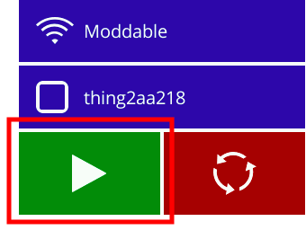

### WebUSB Instructions

To install an example using WebUSB, take the following steps.

1. In the top right corner, select **USB** and **ESP32** from the drop-down menus.

	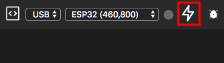
	
2. Click the **Flash** button to install the application.

	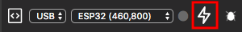

	> If you see `NetworkError: Unable to claim interface` traced to the console, see the [troubleshooting section](#vcp-driver).
	
3. Your device will show up as a **CP2104 USB to UART Bridge Controller**. Select the device and click the **Connect** button to connect to it.

	

	> If the popup says `No compatible devices found` see the [troubleshooting section](#vcp-driver).
	
4. If the installation is successful, you will see the following messages traced to the Log at the bottom of the WebIDE.

	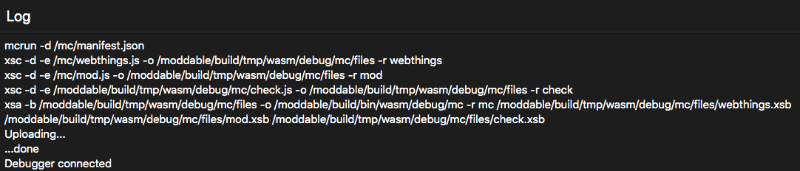
	
	> If you see `File exists` traced to the console, see the [troubleshooting section](#file-exists).
	
### WebSockets Instructions

To install an example using WebSockets, take the following steps.

1. In the top right corner, select **Wi-Fi** from the drop-down menus.

	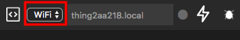
	
2. Enter the hostname of your device. The hostname is the name you screen on the main screen of your device with `.local` added to the end, for example `thing2aa218.local`.

	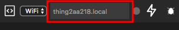
	
3. Click the **Flash** button to install the application.

	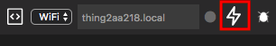
	
4. If the installation is successful, you will see the following messages traced to the Log at the bottom of the WebIDE.

	
	
	> If you see `File exists` traced to the console, see the [troubleshooting section](#file-exists).
	
	> If you never see `Uploading...` traced to the console, see the [troubleshooting section](#no-upload).

<a id="gateway"></a>
## Connecting to the WebThings Gateway

To connect to your device from the WebThings Gateway, take the following steps.

1. Click the **+** button to start scanning for devices.

	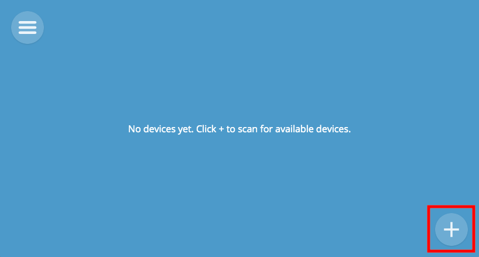

2. Your device should be discovered automatically. If it's not, press **Add by URL...**, enter the URL of the device's description, and press **Submit**. The URL is of the format:

	`<DEVICE_NAME>.local/thng/desc/<DEVICE_NAME>`

	For example, if your device is named `thing2AA488`, it would be `thing2AA488.local/thng/desc/thing2AA488`.
	
	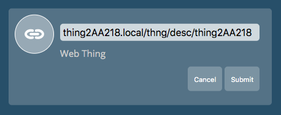

3. Press the **Save** button to add it to your Things page. Then press **Done** to go to the Things page.

	 
	
	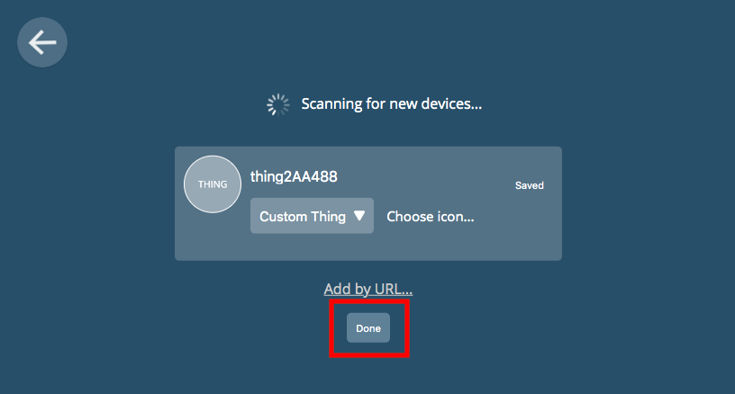

Now you can interact with the device as you would with any other WebThing. You can control its state, monitor its properties, create rules, and more. See the [Gateway User Guide](https://iot.mozilla.org/docs/gateway-user-guide.html) for more information on all the features of the WebThings Gateway.

<a id="resources"></a>
## Resources
Now that you are able to build, install, and run the examples, you are ready to start coding. You can start by changing the examples to support additional properties or change the user interface before moving on to creating your own WebThing.

The [Moddable SDK](https://github.com/Moddable-OpenSource/moddable) includes many developer resources. The readme at the root of the repository contains an overview of what's there.

The following resources are particularly useful for learning to create your own WebThings:
 
- The [Piu user interface framework](https://github.com/Moddable-OpenSource/moddable/blob/public/documentation/piu/piu.md) is an object-based framework that makes it easier to create complex, responsive layouts. The examples from this tutorial are all built using Piu.

- The [Working with Mozilla’s Project Things blog post](https://blog.moddable.com/blog/mozilla-project-things/) on the Moddable blog provides general information about Mozilla WebThings (formerly called Project Things) and the Moddable implementation of the WebThing API.

- The Mozilla [WebThings documentation](https://github.com/Moddable-OpenSource/moddable/blob/public/documentation/network/webthings.md) describes how to use the Moddable implementation of the WebThing API.

- [150+ example apps]((https://github.com/Moddable-OpenSource/moddable/tree/public/examples)) and [extensive documentation](https://github.com/Moddable-OpenSource/moddable/tree/public/documentation) of all the features of the Moddable SDK.

<a id="troubleshooting"></a>
## Troubleshooting

This section lists common issues and how to resolve them.

<a id="vcp-driver"></a>
### `NetworkError: Unable to claim interface` or `No compatible devices found`

If you have the [Silicon Labs VCP Driver](https://www.silabs.com/products/development-tools/software/usb-to-uart-bridge-vcp-drivers) installed, you will get the following error when you try to install an application on your device from the WebIDE:

```
NetworkError: Unable to claim interface.
** Looks like you need to uninstall the driver **
```

You can uninstall the driver by running the uninstall script provided by Silicon Labs. You may have to restart your computer after uninstalling for the change to take effect. Alternatively, you can disable it while you use the WebIDE, then re-enable it when you're done.

On macOS, to disable the VCP driver, run the following command from Terminal:

```
sudo kextunload -b com.silabs.driver.CP210xVCPDriver
```

To re-enable the VCP driver, run the following command from Terminal:

```
sudo kextload -b com.silabs.driver.CP210xVCPDriver
```

<a id="file-exists"></a>
### `File exists`

If you see the message `File exists` when you try to install an application, simply refresh the page and try again.

<a id="no-upload"></a>
### `Uploading...` message never shows in console

If you never see the `Uploading...` message traced to the console, open the JavaScript console in Chrome.

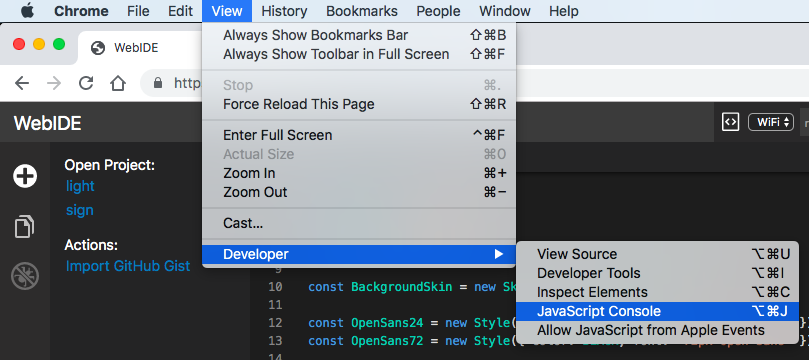

You may see a Mixed Content error like in the following image. 
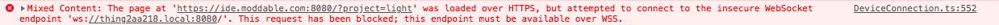

If so, take the following steps:

1. Click the Insecure Content warning icon in the URL bar.

	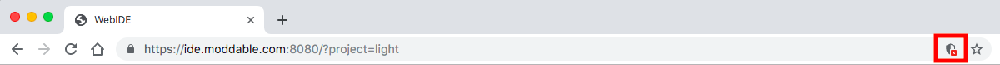

2. Click "Load Unsafe Scripts" in the popup to give the site permission to connect to the device.

	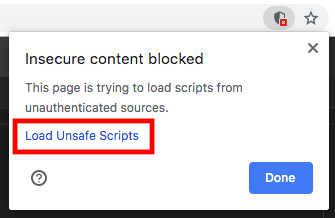

You may see an ERR\_NAME\_NOT\_RESOLVED error like in the following image.
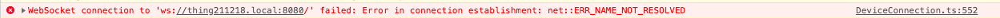

If so, make sure you entered the correct hostname in the WebIDE and your device is connected to the same Wi-Fi network as your laptop.

### Touch screen doesn't work properly

If the touch screen on your device doesn't seem to respond correctly to touch, the touch driver may need to be recalibrated. Find someone from Moddable and ask them to recalibrate the touch using the `$MODDABLE/examples/drivers/xpt2046calibrate` app. Alternatively, if you have the Moddable SDK installed, you can build, install, and run the app yourself.

<!--### Device hangs during installation-->


